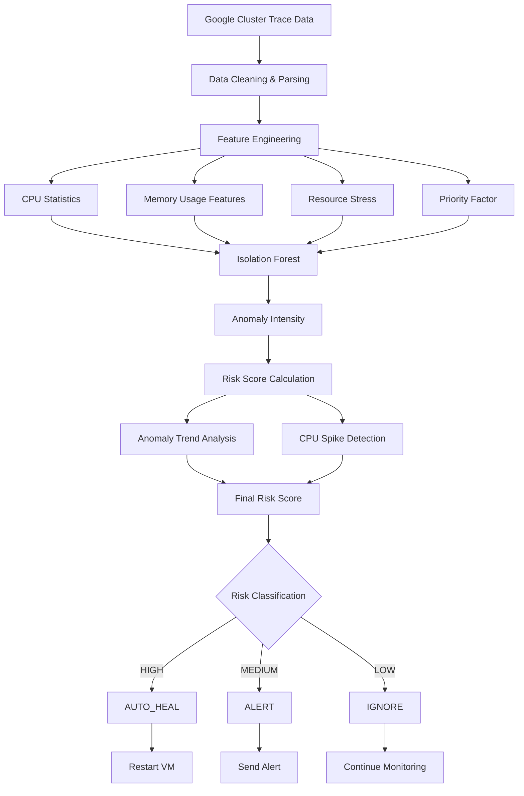
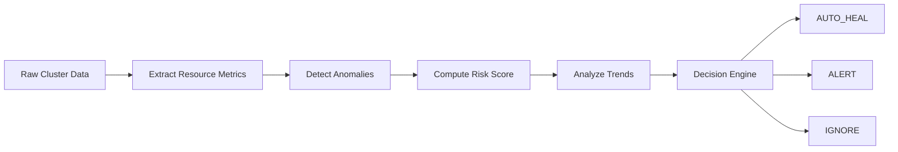

# Autonomous Cloud Failure Management System

Autonomous cloud monitoring and self-healing framework using Isolation Forest anomaly detection and risk-based decision making on Google Cluster Trace data.

---

## Overview

This project implements an autonomous cloud monitoring and self-healing framework using the Google 2019 Cluster Trace dataset.

The system combines anomaly detection, resource utilization analysis, temporal trend monitoring, and risk-based decision making to identify potentially failing workloads and automatically recommend corrective actions.

The objective is to move beyond traditional threshold-based monitoring by introducing an intelligent decision engine capable of:

* Detecting abnormal resource behavior
* Estimating workload risk levels
* Triggering automated recovery actions
* Reducing manual operational intervention

---

## System Architecture

The architecture consists of multiple stages including data preprocessing, feature engineering, anomaly detection, risk assessment, and autonomous decision making.

---

## Processing Workflow

The following workflow summarizes how raw cloud telemetry is transformed into autonomous operational decisions.

---

## Features

### Feature Engineering

The system extracts and generates:

* CPU mean, maximum, and standard deviation
* Tail CPU statistics
* Memory utilization metrics
* Resource stress indicators
* CPU spike measurements
* Priority-aware workload importance

### Anomaly Detection

Isolation Forest is used to identify abnormal workload behavior without requiring labeled failure data.

### Risk Assessment

A composite risk score combines:

* Anomaly intensity
* Resource stress
* Priority factor
* CPU spike behavior
* Temporal anomaly trends

### Autonomous Decision Engine

The framework classifies workloads into:

| Risk Level | Action    |
| ---------- | --------- |
| High       | AUTO_HEAL |
| Medium     | ALERT     |
| Low        | IGNORE    |

### Automated Responses

| Action    | Response            |
| --------- | ------------------- |
| AUTO_HEAL | Restart VM          |
| ALERT     | Send Alert          |
| IGNORE    | Continue Monitoring |

---

## Dataset

### Google 2019 Cluster Sample Dataset

The dataset contains workload execution traces including:

* CPU utilization
* Memory consumption
* Scheduling metadata
* Resource allocation
* Failure indicators

---

## Technology Stack

* Python
* Pandas
* NumPy
* Scikit-learn
* Isolation Forest
* Matplotlib

---

## Results

The system successfully:

* Detects anomalous workload behavior
* Generates risk-aware classifications
* Produces autonomous recovery recommendations
* Evaluates decisions against actual failure records

Generated visualizations include:

* Action Distribution
* Failure Outcome Analysis
* Risk Score Distribution

---

## Future Improvements

Potential extensions include:

* Real-time streaming deployment
* Reinforcement-learning based recovery policies
* Multi-step recovery workflows
* Kubernetes integration
* Predictive failure forecasting

---

## Project Summary

This project demonstrates how unsupervised anomaly detection and risk-based decision making can be combined to create an autonomous cloud monitoring and recovery framework capable of identifying abnormal workloads and recommending corrective actions.
